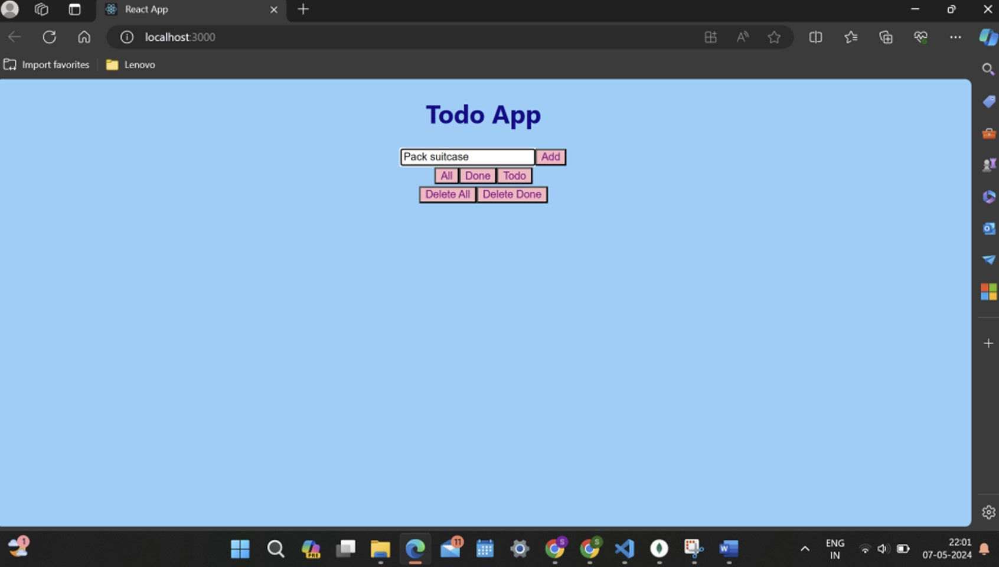
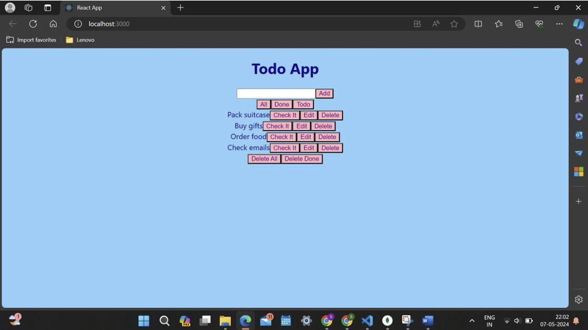
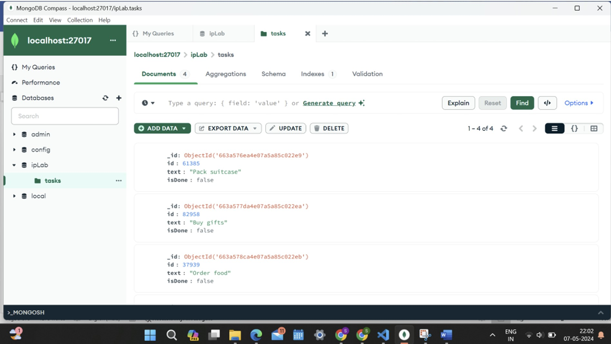
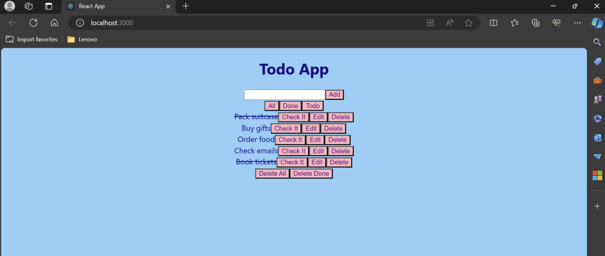
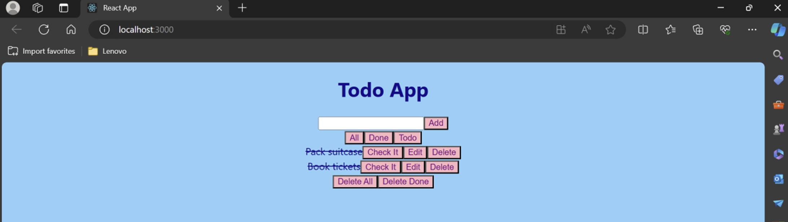
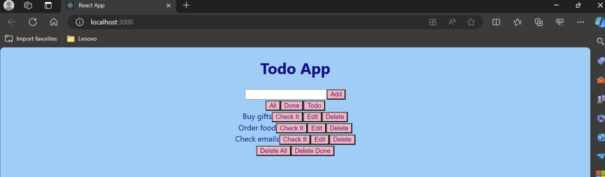
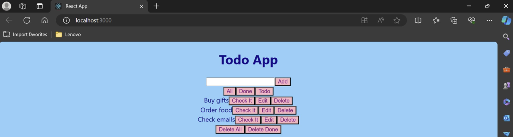
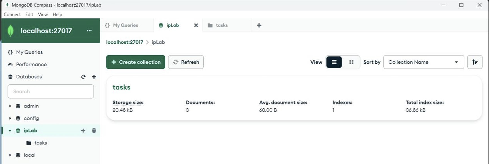
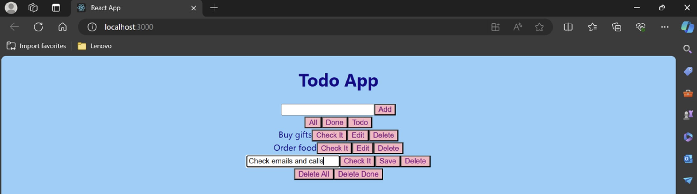
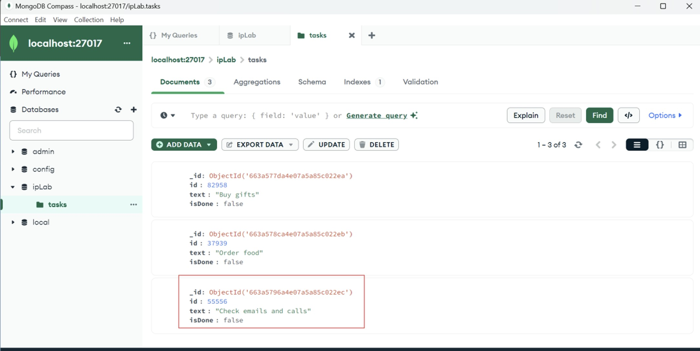

# Full-Stack To-Do Application

## Overview
This project is a simple yet robust **To-Do Application** that allows users to manage tasks efficiently. It includes features like adding, editing, marking tasks as done, filtering tasks, and deleting tasks. Built with **ReactJS**, **Node.js**, and **MongoDB**, the application demonstrates a full-stack implementation.

---

## Features
- **Add Tasks**: Create new tasks with unique IDs.
- **Edit Tasks**: Update task details.
- **Mark as Done**: Toggle task completion status.
- **Filter Tasks**: View all tasks, completed tasks, or remaining tasks.
- **Delete Tasks**: Remove single or all completed tasks.

---

## Architecture
The application follows the **MVC (Model-View-Controller)** pattern:
1. **Model**: MongoDB for storing task data.
2. **View**: ReactJS for the frontend interface.
3. **Controller**: Node.js with Express for handling API requests.

---

## Tech Stack
- **Frontend**: ReactJS
- **Backend**: Node.js, Express.js
- **Database**: MongoDB
- **Tools**: Postman for API testing

---

## Installation and Setup
### Prerequisites
- Node.js and npm
- MongoDB installed locally or access to a MongoDB cluster

### Steps
1. Clone the repository:
   ```bash
   git clone https://github.com/your-repo-url/todo-app.git
   ```
2. Install dependencies for the server and client:
   ```bash
   cd server
   npm install
   cd ../client
   npm install
   ```
3. Configure MongoDB:
   - Update the connection URI in `server.js`:
     ```javascript
     const uri = "mongodb://localhost:27017";
     const dbName = "todo-list-db";
     ```
4. Start the server:
   ```bash
   cd server
   node server.js
   ```
5. Start the frontend:
   ```bash
   cd ../client
   npm start
   ```
6. Access the application in your browser at `http://localhost:3000`.

---

## API Endpoints
| Method | Endpoint          | Description                      |
|--------|-------------------|----------------------------------|
| GET    | `/fetch`          | Fetch all tasks                 |
| POST   | `/add`            | Add a new task                  |
| POST   | `/delete`         | Delete a specific task           |
| POST   | `/deleteall`      | Delete all tasks                |
| POST   | `/deletedone`     | Delete all completed tasks       |
| POST   | `/update`         | Update a task                   |


---

## Output
1. **Adding Tasks**: Users can add tasks through the frontend, which updates in MongoDB.
2. **Filtering Tasks**: View tasks based on their status (all, done, to-do).
3. **Editing Tasks**: Edit task details and see updates reflected in MongoDB.
4. **Deleting Tasks**: Delete completed tasks or all tasks and verify in MongoDB.

---
### Adding Tasks



### Verifying Creation in MongoDB


### Checking tasks which are done


### Displaying completed tasks


### Displaying remaining to-do tasks


### Deleting all completed tasks


### Verifying Deletion in MongoDB


### Editing task


### Verifying Updation in MongoDB

